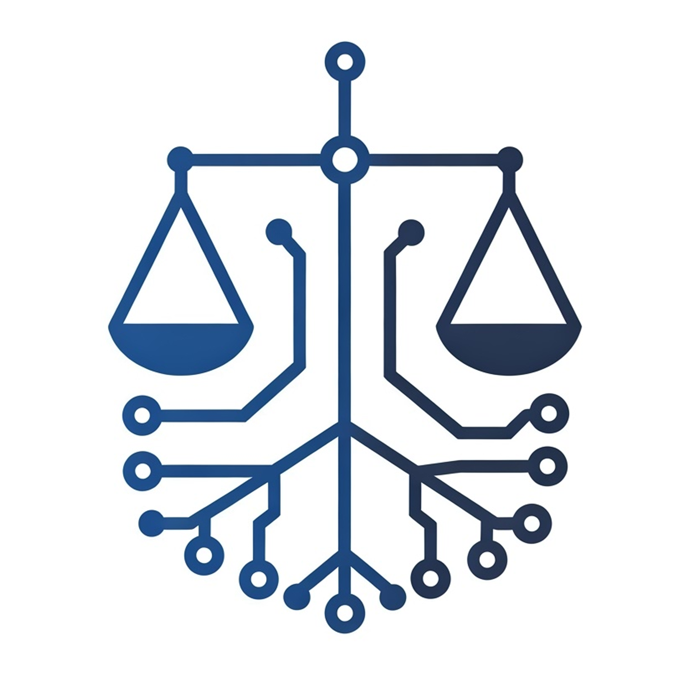

# Nomos - AI-Powered Legal Document Analyzer

<div align="center">
  
</div>

Nomos is a sophisticated legal document analysis tool that leverages artificial intelligence to streamline the process of reviewing, analyzing, and extracting insights from legal documents.

## Features

- 📄 Automated document parsing and analysis
- 🔍 Key clause identification and extraction
- 📊 Risk assessment and highlighting
- 📝 Summary generation for complex legal documents
- 🔄 Version comparison and change tracking
- 🏷️ Smart document categorization

## Tech Stack

- **Framework**: Next.js 15 with App Router
- **Language**: TypeScript
- **Styling**: TailwindCSS
- **Database**: PostgreSQL (via Supabase)
- **ORM**: Prisma
- **Authentication**: NextAuth.js

## Getting Started

### Prerequisites

- Node.js (v18.0 or higher)
- PostgreSQL database (we use Supabase)

### Installation

1. Clone the repository

   ```
   git clone https://github.com/generyand/nomos.git
   cd nomos
   ```

2. Install dependencies

   ```
   npm install
   ```

3. Configure environment variables

   ```
   cp .env.example .env
   # Add your Supabase and other configuration details
   ```

4. Set up the database

   ```
   npx prisma generate
   npx prisma db push
   ```

## Development

1. Start the development server

   ```
   npm run dev
   ```

2. Open [http://localhost:3000](http://localhost:3000) in your browser

## Building for Production

1. Build the application

   ```
   npm run build
   ```

2. Start the production server

   ```
   npm start
   ```

## Project Structure

```
nomos/
├── app/                    # Next.js app directory
│   ├── api/               # API routes
│   ├── (auth)/            # Authentication pages
│   └── (dashboard)/       # Dashboard pages
├── components/            # React components
├── lib/                   # Utility functions and shared logic
├── prisma/               # Database schema and migrations
└── public/               # Static assets
```

## Documentation

For detailed documentation, please visit our [Wiki](https://github.com/yourusername/nomos/wiki).

## Contributing

We welcome contributions! Please see our [Contributing Guidelines](CONTRIBUTING.md) for details.

1. Fork the repository
2. Create your feature branch (`git checkout -b feature/AmazingFeature`)
3. Commit your changes (`git commit -m 'Add some AmazingFeature'`)
4. Push to the branch (`git push origin feature/AmazingFeature`)
5. Open a Pull Request

## License

This project is licensed under the MIT License - see the [LICENSE](LICENSE) file for details.

## Support

For support, please open an issue in the GitHub repository or contact our support team at support@nomos.ai

## Acknowledgments

- Built with ❤️ for the legal community
- Powered by modern web technologies and AI

---

**Note:** Nomos is currently in active development. Features and documentation may be updated frequently.
